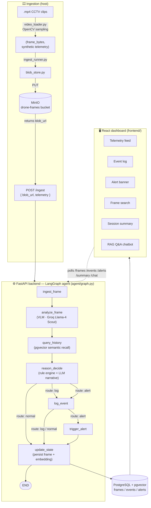
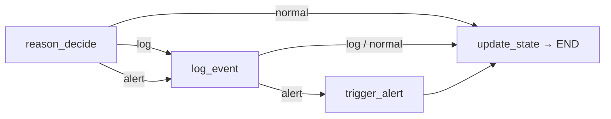

# Drone Security Analyst Agent — Flow Diagram

End-to-end data flow, from source clip through the LangGraph agent to the operator
dashboard. Conditional routing inside the agent (`normal` / `log` / `alert`) mirrors
`agent/graph.py`.

## End-to-end pipeline

## Agent routing detail (`reason_decide` → END)

- **normal** — no event/alert; frame is persisted only.
- **log** — `log_event` records the event, then persist.
- **alert** — `log_event` **and** `trigger_alert` fire (rules: after-hours person/vehicle,
  loitering, repeat vehicle, restricted zone), then persist.
